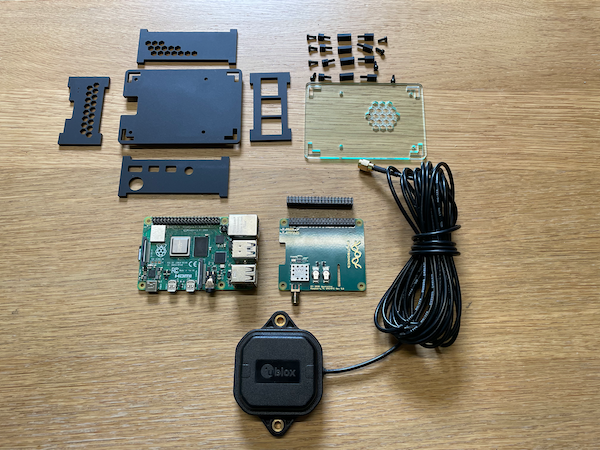
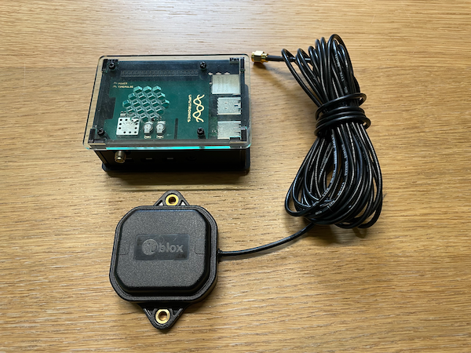
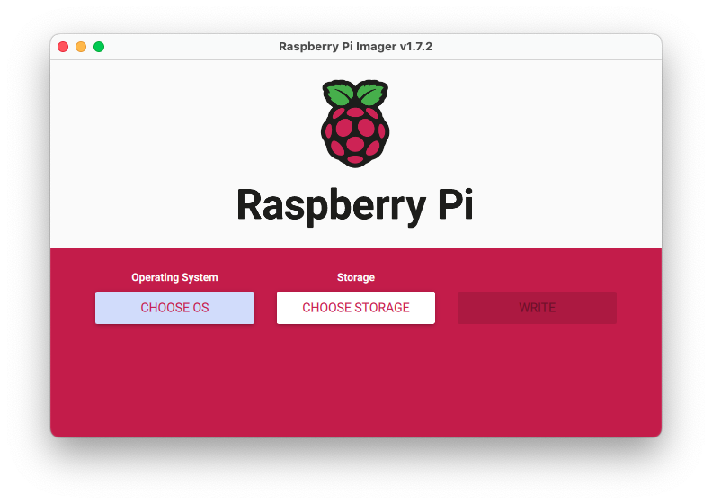
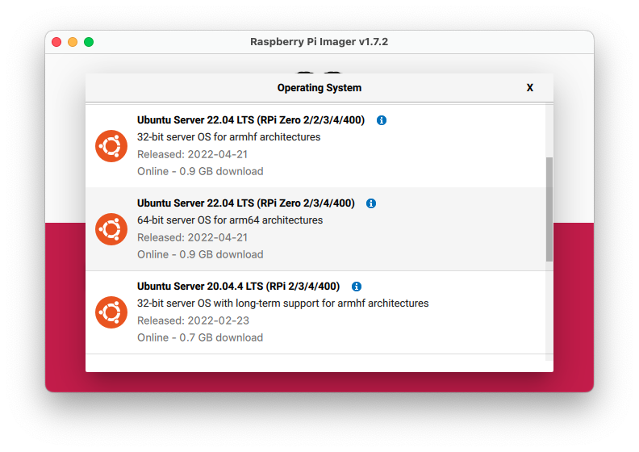
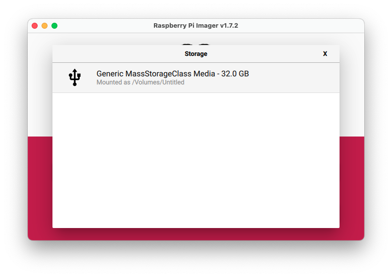
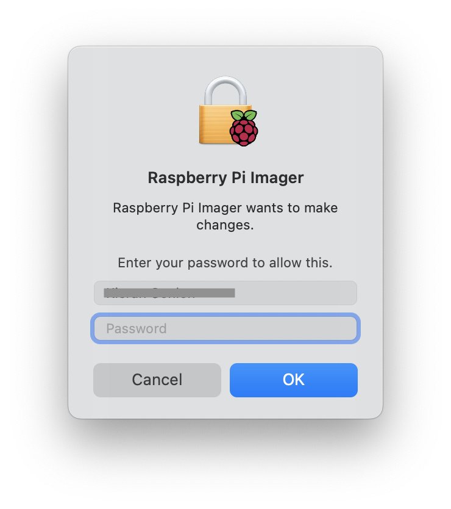
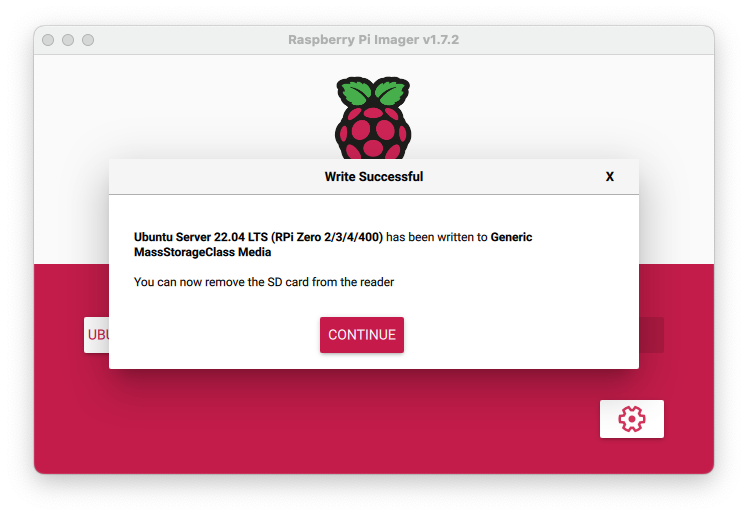
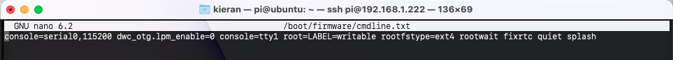
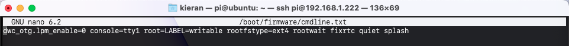
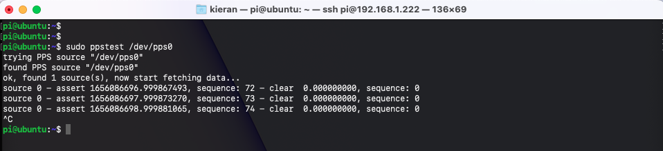

# Building a RaspberryPi4 with uBlox GPS-RTC on Ubuntu 22.04 Server

Aim of this project is to build a simple GNSS receiver, running on a RaspberryPi, that could then be used as a development test rig for GNSS applications.

**Basic Setup Procedure**

1. Assemble the RPi and GNSS receiver board
2. Flash Ubuntu 22.04 LTS Server to microSD
3. Configure Ubuntu Server for headless setup and remote access using SSH
4. Configure I2C and serial/UART on RPi
5. Configure Ubuntu to use GNSS board's external real-time clock (RTC) and remove fake-hwclock
6. Test/check messages from the uBlox GNSS receiever

TODO: **Additional Setup Procedure**

To use this RPI/GNSS as a development test rig it is useful to install a programming language (I am using Swift) and to perform some additional configuration steps.

This guide will also show how to configure the system so that we can edit code on a MacBook using Xcode, being able to keep the full benefit of the Xcode IDE.

1. Install Swift for ARM
2. (Optional) Install git
3. Configure network sharing with Samba
4. Connect to the network share on the RPi from macOS
5. Create a `helloGPS` application, on macOS
6. Compile and run `helloGPS` on RPi

---

## Basic Setup

### Equipment

The equipment used for this guide is:

- RaspberryPi 4 Model B, with power supply
- RaspberryPi GPS/RTC Expansion Board
- Active GPS Antenna (with SMA Connector)
- microSD card (16GB min, suggested 32GB)
- microSD card reader
- PC/laptop, connected to your WiFi

There are many GPS expansion boards and antennas available for the RPi, the GPS/RTC expansion board and GPS antenna used in this guide are:

- **Uputronics RPi GPS-RTC Expansion Board** available from [PiHUT](https://thepihut.com/collections/raspberry-pi-gps-gsm-lora-hats/products/raspberry-pi-gps-hat) or direct from [Uputronics](https://store.uputronics.com/index.php?route=product/product&path=60_64&product_id=81).  I am actually using a slightly older version of this expansion board (without the USB-C header connector) but the procedure should be the same with the more modern version of the board.
- **uBlox Multi-Band Active GPS Patch Antenna**.  Being multi-band (GPS/Galileo/GLONASS/BeuDou) this antenna is slightly more expensive that the single-band (GPS-only) versions, either antenna should work.  Multi-band antenna available from [Uputronics](https://store.uputronics.com/index.php?route=product/product&path=60_65&product_id=120).  Single-band antennas available from [PiHUT](https://thepihut.com/products/gps-antenna-external-active-antenna-3-5v-28db-5-meter-sma) or [Uputronics](https://store.uputronics.com/index.php?route=product/product&path=60_65&product_id=67).

### Assemble the Hardware

For my setup I decided to buy a case to hold my RPi and GPS expansion board, not necessary for this project but it does help keep all the parts held together and saves possible damage.



The purchased my case from PiHut, [GPS HAT Case for RPi](https://thepihut.com/products/gps-hat-case-for-raspberry-pi-4)

The final assembly.



### Flash Ubuntu 22.04 Server to microSD

I used the offical Raspberry Pi Imager app to flash an OS to the microSD card, available from [raspberrypi.com/software](https://www.raspberrypi.com/software/).  Other flash applications are available, such as [balenaEtcher](https://www.balena.io/etcher/), the process to flash the OS will be very similar.



For the OS I don't want the overhead of a desktop on the RPi but I want to make the most of the 64-bit architecture on the RPi so will use Ubuntu Server 22.04 LTS (RPi 4, 64-bit).  

- Connect the SD card reader to your laptop and insert a blank microSD card.
**N.B.** If the microSD card is not blank, flashing the OS to the SD card will completely overwrite any data on the card.

On the RPi Imager app click...

- Choose OS
- Other general-purpose OS
- Ubuntu
- Ubuntu Server 22.04 LTS (RPi Zero/2/3/4/400), 64-bit for arm64



Next, choose which storage device to flash the OS image to, click...
 - Choose Storage
 - Select the microSD card from the list



Before flashing the OS, the RPi Imager application allows you to configure settings that will help for a headless installation.  Click the gear icon  then set the following...

- **Image customization options**: I suggest using `for this session only`, but if you intend to repeat this setup multiple times then selecting `to use always` is OK.
- **Set hostname**:  OK to leave blank (default setting = `raspberrypi`)
- **Enable SSH**: Enable the checkbox
  - **Use password authentication**
- **Set username and password**: Enable the checkbox
   - **Username**: {your_username} (default = pi)
   - **Password**: {your_password}
- **Configure wireless LAN**: Enable the checkbox
  - **SSID**: {your_wifi_ssid}
  - **Password**: {your_wifi_password} 
  - **Wireless LAN country**: {your_country_code}
- **Set locale settings**:  Enable the checkbox
  - **Time zone**: Etc/UTC (we want of RPi's TZ to be the same as GPS's TZ)
  - **Keyboard layout**: {your_country_keyboard}

Click `SAVE` to save settings and dismiss the pop-up.

With all the settings done, click `WRITE`, you will shown a warning to let you know that the any data on the SD card will be erased, to continue downloading the OS image file and flash the microSD card, clilck `YES`.

Depending on your computer's security settings, you may be prompted for your username and password; this is to give the RPi Imager app permissions to write to the SD card.



The RPi Imager will download the OS image, write the OS to the SD card and then verify that it has copied to the SD card correctly, this could take some minutes to complete.



When the flash process has finished, click `CONTINUE`, then eject and remove your microSD card from the reader.

Insert the microSD card into the RPi, then power-up the RPi.

### Finding the IP address of the RPi

When the RPi boots, it will connect to the WiFi using DHCP and the credentials provided during the microSD flash process.  In order to connect to the RPi using SSH we need to know the IP address that the WiFi router has assigned to the RPi.

Open a `terminal` window on your laptop/PC and scan the network for available devices using one or all of the following:

#### Using `arp`

``` bash
arp -a
```

Use `arp` and `grep` to return only IPs with name `raspberry` or part of the RPi's MAC address

``` bash
arp -a | grep raspberry
```

``` bash
arp -a | grep dc:a6
```

#### Using `nmap`

IP range assignment may vary for individual routers, typically `192.168.1.0` is the base address of most routers with a mask of `/24` to give access to a range of IPs from `192.168.1.0` to `192.168.1.255`

``` bash
nmap -sn 192.168.1.0/24
```

Check the list of devices to find the one with `raspberry` in the description.

### Connect to RPi using SSH

From a terminal window on your laptop/PC, connect to the RPi using `ssh`, replace `xx.xx.xx.xx` with the IP of the RPi. When prompted, enter the SSH password created during the microSD flash process.

``` bash
ssh pi@xx.xx.xx.xx
```

### Update the OS

Before making any changes to the RPi it is recommended to update the Ubuntu OS.

``` bash
sudo apt update
```

The update process may take some time, then upgrade the OS.

``` bash
sudo apt upgrade
```

The upgrade may take some time to complete, you may be prompted to restart some services or reboot.  

### Setup Serial and I2C Interfaces

Before we can use the GNSS expansion board with the RPi we need to configure the serial ports and I2C interfaces correctly.

#### Serial Port Configuration

By default Ubuntu is set to enable a serial-console, this must be disabled otherwise the `root` user will constantly take ownership of the serial port, typically this will be on `/dev/serial0`, a symlink to `/dev/ttyS0` which is the UART serial port that the GPS board is using.

``` bash
sudo nano /boot/firmware/cmdline.txt
```



Delete the entry `console=serial0,115200 `



Save and exit nano.

Reboot `sudo reboot`, login via SSH after approx. 1 minute.

Check that the `pi` user is able to read data the GPS board is sending to the serial port.

``` bash
cat /dev/serial0
```

The data may contain a lot of blank lines and/or 'unknown' data.  For a cleaner output it may help to exclude these.

``` bash
cat /dev/serial0 | grep -v -E "(unknown|^$)" 
```

Example output:
``` bash
$GNGSA,A,3,21,01,08,32,22,03,17,19,04,,,,1.13,0.69,0.89*13
$GNGSA,A,3,88,72,65,87,81,66,73,82,,,,,1.13,0.69,0.89*1F
$GPGSV,4,1,14,01,74,107,42,03,71,235,27,04,20,177,26,08,09,167,17*7B
$GPGSV,4,2,14,14,12,252,16,17,46,296,38,19,25,314,38,21,47,117,38*72
$GPGSV,4,3,14,22,36,060,36,28,,,32,31,06,090,14,32,20,042,37*4F
$GPGSV,4,4,14,36,23,142,,49,29,173,*7C
$GLGSV,3,1,11,65,68,059,35,66,45,199,25,72,19,037,23,73,12,005,23*6C
$GLGSV,3,2,11,74,00,047,,80,10,319,,81,64,317,38,82,14,316,35*6E
$GLGSV,3,3,11,87,11,134,30,88,57,134,41,95,10,319,*58
```

### Configuring the I2C bus and hardware clock

To use the GPS board fully and to make use of the hardware real-time clock (RTC) on the GPS board, we have to setup the I2C correctly and modify the `hwclock` settings.

Install the necessary tools.

``` bash
sudo apt install 12c-tools python3-smbus
```

Check the current configuration of I2C

``` bash
sudo i2cdetect -y 1
```

Output should be...

``` bash
     0  1  2  3  4  5  6  7  8  9  a  b  c  d  e  f
00:                         -- -- -- -- -- -- -- -- 
10: -- -- -- -- -- -- -- -- -- -- -- -- -- -- -- -- 
20: -- -- -- -- -- -- -- -- -- -- -- -- -- -- -- -- 
30: -- -- -- -- -- -- -- -- -- -- -- -- -- -- -- -- 
40: -- -- 42 -- -- -- -- -- -- -- -- -- -- -- -- -- 
50: -- -- 52 -- -- -- -- -- -- -- -- -- -- -- -- -- 
60: -- -- -- -- -- -- -- -- -- -- -- -- -- -- -- -- 
70: -- -- -- -- -- -- -- --                         
```

The RTC is at addr `0x52` and the GPS at addr `0x42` on the I2C bus.

We need to modify the system config such that the RTC can be used by the OS.

``` bash
sudo nano /boot/firmware/config.txt
```

At the end of the file, after `[all]` add ...

``` bash
dtoverlay=i2c-rtc,rv3028
```

The RTC on the Uputronics board is a Micro Crystal RV-3028-C7 real time clock module, `rv3028` is the identifier for this RTC.

Reboot and SSH login again.

Check that the I2C bus has been updated correctly.

``` bash
sudo i2cdetect -y 1
```

Output should be...

``` bash
     0  1  2  3  4  5  6  7  8  9  a  b  c  d  e  f
00:                         -- -- -- -- -- -- -- -- 
10: -- -- -- -- -- -- -- -- -- -- -- -- -- -- -- -- 
20: -- -- -- -- -- -- -- -- -- -- -- -- -- -- -- -- 
30: -- -- -- -- -- -- -- -- -- -- -- -- -- -- -- -- 
40: -- -- 42 -- -- -- -- -- -- -- -- -- -- -- -- -- 
50: -- -- UU -- -- -- -- -- -- -- -- -- -- -- -- -- 
60: -- -- -- -- -- -- -- -- -- -- -- -- -- -- -- -- 
70: -- -- -- -- -- -- -- --                         
```

Now at adrr `0x52` should be `UU` to indicate that the RTC is being used by the OS kernel driver.

Now the OS must be configured to use the hardware RTC instead of the fake hardware clock that is used by default.

``` bash
sudo apt-get -y remove fake-hwclock
sudo update-rc.d -f fake-hwclock remove
sudo systemctl disable fake-hwclock
sudo nano /lib/udev/hwclock-set
```
Comment out the lines:
``` bash
#if [ -e /run/systemd/system ] ; then
#    exit 0
#fi
#
#/sbin/hwclock --rtc=$dev --systz
```

sudo hwclock -v -r

### Configure the GPS/PPS

In order for correct NTP operation, the PPS from the GPS must also be configured.

``` bash
sudo apt install pps-tools
sudo nano /boot/firmware/config.txt
```

At the end of the file, after `[all]` add ...

``` bash
dtoverlay=pps-gpio
```

We also need to update the system modules

``` bash
sudo nano /etc/modules
```

At the end of the file, add...
``` bash
pps-gpio
```

Reboot and SSH login again.

Check that the PPS is operating correctly.

``` bash
sudo ppstest /dev/pps0
```

Output should be similar to...



**N.B.**  Since V3.00 of the Ublox firmware the time pulse is not released until all time parameters are known including leap seconds. There it could be up to 12.5 minutes before time pulse is available however positional lock is achieved from cold in the expected sub 30 seconds.
